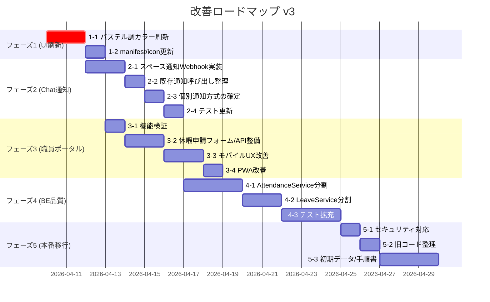

# 職員打刻・休暇申請・給与明細アプリ — 改善計画 v5

**更新日: 2026-04-15｜前回: 2026-04-11**

> Codex による実装実態の再確認を反映し、通知方式・職員ポータル要件・PWA 対応の前提を補正しました。2026-04-15 時点でフェーズ1とフェーズ3は実装完了、本番サーバー反映と本番画面確認も実施済みです。フェーズ2は別スレッドで整理された Google Chat API 案を参考に再定義しています。

---

## 0. ユーザーフィードバック反映サマリ

| 質問 | 回答 | 計画への反映 |
|---|---|---|
| セキュリティ対応即時実施？ | ❌ テスト段階のため開発の手間を避けたい | → 本番運用開始時に実施（フェーズ5に移動） |
| メール通知の優先度？ | ❌ 不要。Google Chat 一本化 | → メール通知計画を削除、Chat API/サービスアカウント方式をフェーズ2へ |
| 職員ポータルの休暇申請？ | まだテスト段階で未確認 | → 職員ポータル全体の検証と整備をフェーズ3へ |
| Google Chat 連携の要否？ | ✅ 必要。通知はChat一本化したい | → フェーズ2の中核タスクとして位置付け |
| バックエンドサービス分割？ | ✅ 進めてOK | → フェーズ4で実施 |
| 旧コード削除のタイミング？ | 影響を知りたい | → 影響分析を後述、削除はフェーズ5 |
| **追加要望** | **パステル調の明るいUIに一新** | → **フェーズ1として最優先** |

---

## 0-1. 実装進捗（2026-04-15 時点）

| フェーズ | 状態 | 備考 |
|---|---|---|
| フェーズ1: UI / PWA 見た目刷新 | ✅ 完了 | テーマ変更、PNG アイコン、モバイル崩れ修正、ログイン導線と icon 競合の補修まで反映済み |
| フェーズ2: Google Chat 通知 | ⏳ 未着手 | 別スレッドの参考実装をもとに Laravel/Next 向けへ再設計済み |
| フェーズ3: 職員ポータル整備 | ✅ 完了 | 休暇申請フォーム、部分同期、モバイル専用表示、PWA 実機相当確認に加え、本番の管理者/職員画面確認まで完了 |
| フェーズ4: バックエンド分割とテスト | ⏳ 未着手 | 次の主要候補 |
| フェーズ5: 本番移行準備 | ◐ 一部着手 | SSH 反映、本番画面確認、職員APIの role ガード修正まで実施。秘密情報整理や運用資料は未着手 |

---

## 0-2. 本番確認結果（2026-04-15）

| 項目 | 結果 | 備考 |
|---|---|---|
| 管理者ログイン | ✅ 成功 | `hasiken0229@gmail.com / hasiken0229` で確認 |
| 職員ログイン | ✅ 成功 | `staff001 / Staff1234!` で確認 |
| 管理者画面 desktop | ✅ 正常 | console error なし |
| 管理者画面 mobile | ✅ 正常 | 横スクロールなし |
| 職員画面 desktop | ✅ 正常 | `mobile/home` を含む職員APIが 200 |
| 職員画面 mobile | ✅ 正常 | `390px` 幅で `scrollWidth: 390` |
| ログアウト導線 | ✅ 正常 | 管理者/職員とも `/dakoku/login/` に戻る |
| 本番APIガード | ✅ 修正済み | 管理者トークンで `/api/mobile/home` を叩いた場合は `500` ではなく `403 JSON` を返す |

> [!NOTE]
> 2026-04-15 の本番確認で、職員APIに管理者トークンを入れた場合に `/api/mobile/home` が `500` になる不整合を検出し、`employee` ミドルウェアを追加して解消しました。

---

## 1. 旧コード削除の影響分析

> [!NOTE]
> 本番コード（`backend-laravel-app`, `admin-web/next-app`, `windows-punch`）からの参照を全検索しました。**依存はゼロ**です。

| ディレクトリ | 内容 | サイズ | 本番コードからの参照 | 削除の影響 |
|---|---|---|---|---|
| `src/backend/` | .NET API 試作（Program.cs 14KB + Models + Services） | 小 | **なし** | 🟢 **影響なし** |
| `src/admin-web/prototype/` | 静的HTML試作（index.html + app.js + styles.css） | 22KB | **なし** | 🟢 **影響なし** |
| `src/backend-laravel-skeleton/` | Laravel 初期骨組み（Controllers + Services のひな型） | 小 | **なし** | 🟢 **影響なし** |
| `sql/schema.sql` | PostgreSQL版スキーマ（本番はMySQL） | 10KB | **なし** | 🟢 **影響なし** |

**結論**: いずれも完全に独立した旧資産であり、**削除してもビルド・動作・テストに一切影響しません**。唯一の価値は「過去の設計意図の参照」ですが、`docs/` の設計書群がその役割を十分にカバーしています。

> [!TIP]
> 削除前に `_archives/` フォルダへ移動しておけば、万が一参照が必要になった場合にも対応可能です。

---

## 2. 現在のUI配色構造の分析

パステル化に先立ち、現在の暗色テーマの構成を整理しました。

### 現在の配色（暗めのアース調）

```
キャンバス（背景）: #f3ecdf ← ベージュ系（暗すぎはしないが沈んだ色合い）
サーフェス（カード）: rgba(251,247,240,0.88) ← くすんだ白
サイドバー: #121918 → #1a2523 ← 🔴 非常に暗いダークグリーン
ボタン: #1a2928 → #27403c ← 🔴 ダークグリーン
セカンダリボタン: #a05f34 → #c67a3f ← ブラウン系
ログインポスター: #182221 → #2e4a46 ← 🔴 ダークグリーン
アクセント: #be6e35 ← ブラウン/オレンジ
文字色: #141b1c ← ほぼ黒
```

### 変更が必要なファイル

| ファイル | 変更理由 |
|---|---|
| [globals.css](file:///c:/Users/ikega/OneDrive/%E3%83%87%E3%82%B9%E3%82%AF%E3%83%88%E3%83%83%E3%83%97/%E8%81%B7%E5%93%A1%E6%89%93%E5%88%BB%E6%9C%89%E7%B5%A6%E7%94%B3%E8%AB%8B%E7%B5%A6%E4%B8%8E%E6%98%8E%E7%B4%B0%E3%82%A2%E3%83%97%E3%83%AA/src/admin-web/next-app/app/globals.css) | **主要変更対象** — CSS変数 + 一部ハードコード色の更新 |
| [manifest.webmanifest](file:///c:/Users/ikega/OneDrive/%E3%83%87%E3%82%B9%E3%82%AF%E3%83%88%E3%83%83%E3%83%97/%E8%81%B7%E5%93%A1%E6%89%93%E5%88%BB%E6%9C%89%E7%B5%A6%E7%94%B3%E8%AB%8B%E7%B5%A6%E4%B8%8E%E6%98%8E%E7%B4%B0%E3%82%A2%E3%83%97%E3%83%AA/src/admin-web/next-app/public/manifest.webmanifest) | `background_color` と `theme_color` の変更 |
| [icon.svg](file:///c:/Users/ikega/OneDrive/%E3%83%87%E3%82%B9%E3%82%AF%E3%83%88%E3%83%83%E3%83%97/%E8%81%B7%E5%93%A1%E6%89%93%E5%88%BB%E6%9C%89%E7%B5%A6%E7%94%B3%E8%AB%8B%E7%B5%A6%E4%B8%8E%E6%98%8E%E7%B4%B0%E3%82%A2%E3%83%97%E3%83%AA/src/admin-web/next-app/public/icon.svg) | アイコンの配色変更 |

> [!IMPORTANT]
> テーマの大半は `globals.css` に集約されているため、**配色変更の中心は `:root` と既存グラデーションの更新**です。大規模な JSX 修正は不要ですが、PWA アイコンや manifest は別途更新が必要です。

---

## 3. 改善計画（全5フェーズ）

### フェーズ 1: パステル調 UI リデザイン（最優先 / 1-2日）

#### 1-1. カラーパレット刷新

**提案パレット（パステル＋スタイリッシュ）：**

| 用途 | 現在 | 新しい色 | イメージ |
|---|---|---|---|
| キャンバス（背景） | `#f3ecdf` ベージュ | `#f0f4ff` アイスブルー | 明るく爽やか |
| キャンバス深 | `#e7ddcf` | `#e4ecf7` | 柔らかい水色 |
| サーフェス（カード） | くすんだ白 | `rgba(255,255,255,0.92)` | クリアな白 |
| サイドバー | `#121918` ダークグリーン | `#6c8ce0` → `#8ba4f0` パステルブルー | 🌟 明るいグラデーション |
| ボタン（プライマリ） | `#1a2928` ダークグリーン | `#6c8ce0` → `#8ba4f0` | パステルブルー |
| ボタン（セカンダリ） | `#a05f34` ブラウン | `#e8a0c0` → `#f0b8d0` | パステルピンク |
| ボタン（危険） | `#783228` 暗赤 | `#e07878` → `#e89898` | ソフトレッド |
| アクセント | `#be6e35` ブラウン | `#c8a0e8` パステルラベンダー | 上品な紫 |
| 文字色 | `#141b1c` ほぼ黒 | `#2d3748` ソフトネイビー | 目に優しい |
| 補助文字 | `#62706e` | `#8896a6` ソフトグレー | 控えめ |
| 罫線 | 暗緑ベース | `rgba(108,140,224,0.12)` | 青系の薄い線 |
| ログインポスター | ダークグリーン | パステルブルーグラデ | 明るい印象 |
| 勤怠グラフ | `#6b9fd3` 青 | `#7cc8e8` ライトスカイ | 透明感 |

#### 1-2. 変更対象と手順

```
① globals.css の :root 変数を全面差し替え
② globals.css 内のハードコード色をパステル色に更新
③ body の background gradient をパステルブルー系に変更
④ manifest.webmanifest の theme_color / background_color を更新
⑤ icon.svg の配色をパステル調に更新
⑥ npm run build で確認
```

#### 1-3. デザインの方向性

- **サイドバー**: ダークグリーン → パステルブルーのグラデーション（文字は白のまま）
- **ボタン**: 重厚なダーク → 軽快なパステルブルー（ホバーで明るく）
- **背景**: ベージュ → 淡いアイスブルー/ラベンダーのグラデーション
- **カード**: ガラスモーフィズム（半透明白 + blur）は維持
- **アニメーション**: 既存の rise-in アニメはそのまま活用

---

### フェーズ 2: Google Chat 通知の段階導入（優先度：高 / 3-5日）

> [!IMPORTANT]
> 別スレッドで整理された実装案では、**Google Chat API + サービスアカウント + 職員ごとの DM 送信**が前提になっています。  
> ただし、今回のワークスペースには `chat_api.php`, `action.php`, `MailTab.tsx`, `googleChatUserId` などの実装は存在しません。以下は **参考実装を現アプリ向け Laravel/Next 構成へ置き換える前提の計画**です。

#### 2-1. Google Chat API 認証基盤の追加

| ファイル | 内容 |
|---|---|
| `app/Services/GoogleChatTokenService.php` [NEW] | サービスアカウント JSON からアクセストークンを取得 |
| `config/staffhub.php` | `google_chat.credentials_path`, `google_chat.bot_scope`, `google_chat.enabled` を追加 |
| `.env.example` | `STAFFHUB_GOOGLE_CHAT_ENABLED`, `STAFFHUB_GOOGLE_CHAT_CREDENTIALS_PATH` などを追加 |

**前提条件：**

- サービスアカウント JSON をサーバーから読めること
- Google Chat API が有効化されていること
- Chat アプリが組織内で利用可能であること
- 対象職員が Chat 上で DM 可能な識別子を持つこと

#### 2-2. Google Chat DM 送信サービスの実装

| ファイル | 内容 |
|---|---|
| `app/Services/GoogleChatNotificationService.php` [NEW] | `spaces:findDirectMessage` と `spaces/.../messages` を呼び出す共通サービス |
| `app/Services/GoogleChatRecipientResolver.php` [NEW] | 職員ごとの Chat 宛先解決 |
| `storage/logs/...` | 失敗時のログ出力先を整理 |

**送信フロー：**

1. サービスアカウントでアクセストークン取得
2. 対象職員の `google_chat_user_id` を解決
3. DM スペースを検索または取得
4. メッセージ本文を整形して投稿
5. 成否を監査ログまたは通知ログへ残す

#### 2-3. 宛先マスタの設計

| ファイル | 変更内容 |
|---|---|
| `employees` テーブル or 関連マスタ | `google_chat_user_id` を保持する設計を追加 |
| 管理UI or CSV | 職員ごとの Chat ID 登録手段を決める |
| バリデーション | 空欄時は送信スキップし、警告ログを出す |

> [!NOTE]
> 参考実装では `googleChatUserId` が最優先で、旧互換として `chatUserId`, `chatUserName`, `email` の順に解決していました。  
> 現アプリではその資産が無いため、まずは **`google_chat_user_id` を正規の唯一キーとして持つ** 方が保守しやすいです。

**2026-04-15 時点の具体化方針：**

| 項目 | 保持先 | 方針 |
|---|---|---|
| 職員ごとの DM 宛先 | `employees.google_chat_user_id` | `users/1234567890` 形式を正規値として保持。数値だけ把握している場合も保存時に `users/` を補う |
| 管理者向けスペース通知 | `config/staffhub.php` + `.env` | `google_chat.admin_space_id` として保持 |
| 全体通知スペース | `config/staffhub.php` + `.env` | `google_chat.all_staff_space_id` として保持 |
| 部門別スペース | 今回は見送り | 必要になった時点で `departments` 系マスタへ拡張 |
| 送信結果ログ | `audit_logs` + Laravel log | 初期段階は専用テーブルを増やさず、失敗時は構造化ログを残す |

**この時点のおすすめ migration 案：**

- `employees` テーブルに `google_chat_user_id` を nullable で追加
- 一意性を保ちたいので `unique` 制約または少なくとも index を付与
- 空欄職員は送信スキップにし、`employee_id`, `notification_type`, `reason=no_google_chat_user_id` をログへ残す

**ID 正規化ルール：**

- `1234567890` のような数値だけを受け取った場合は `users/1234567890` へ正規化して保存
- `users/...` が来た場合はそのまま保存
- スペース ID は `spaces/...` を正規値とし、数値や末尾 ID だけが渡された場合は `.env` 登録時に正規化する

#### 2-4. 通知イベントとテンプレート管理

**第1段階で実装する通知対象：**

| イベント | 通知先 | 初期方針 |
|---|---|---|
| 休暇申請（新規） | 管理者向け | まずは管理者へ送る |
| 休暇承認/却下/差戻し | 本人 | DM 送信対象 |
| 給与明細公開 | 本人 | DM 送信対象 |
| 打刻異常 | 管理者向け | 重複抑止つきで送る |
| お知らせ公開 | 全体 or 対象職員 | 後続判断 |

**通知ルーティングの初期案：**

| イベント | アプリ内通知 | Google Chat 宛先 | 備考 |
|---|---|---|---|
| 休暇申請の新規作成 | 不要 | `admin_space_id` | 管理者の見逃し防止を優先 |
| 休暇申請の承認/却下/差戻し | `notifications` へ保存済み | 対象職員 DM | 既存 DB 通知を残しつつ Chat 追加 |
| 給与明細公開 | `notices` + `notifications` 保存済み | 対象職員 DM | 個人情報のため全体通知しない |
| 管理者が作成した個別お知らせ | `notices` 保存済み | 対象職員 DM | `target_employee_id` がある場合 |
| 管理者が作成した全体お知らせ | `notices` 保存済み | `all_staff_space_id` | 全員 DM にはしない |
| 打刻異常・未退勤 | まずは管理画面表示継続 | `admin_space_id` | 勤怠アラートを後追いで Chat 連携 |

**段階導入の順番：**

1. 管理者向けスペース通知
2. 職員 1 名への DM
3. 給与明細公開 / 休暇承認の DM
4. 全体スペース通知
5. 打刻異常や自動リマインド

**テンプレート方針：**

- 管理画面にテンプレート編集 UI を最初から入れるのではなく、まずは `config/staffhub.php` か専用テンプレートクラスで固定文面から開始
- 差し込み変数は `employeeName`, `employeeCode`, `leaveTypeName`, `startDate`, `endDate`, `statementMonth`, `noticeTitle` など最小限にする
- 長い URL をそのまま出さないよう、将来的なリンク短縮や導線見直し余地を残す

#### 2-5. 既存通知経路の委譲

| ファイル | 内容 |
|---|---|
| `NotificationMailService.php` | 移行用 façade として残し、内部で Google Chat 通知へ委譲 |
| `LeaveRequestService.php` | 新規申請・承認系の呼び出しを整理 |
| `NoticeService.php`, `PayrollService.php`, `AttendanceService.php` | 送信トリガー地点を明示する |

#### 2-6. 定期実行の設計

- 自動リマインドは最初から実装しない
- まずは同期送信または明示的ジョブ実行で動作確認
- 将来的に cron 化する場合は `php artisan schedule:run` またはキュー投入で実装
- 二重送信防止用に通知履歴テーブルまたは監査ログの利用を検討

#### 2-7. テスト

| ファイル | 内容 |
|---|---|
| `tests/Feature/GoogleChatNotificationTest.php` [NEW] | HTTP fake で DM 検索とメッセージ投稿を検証 |
| `tests/Feature/NotificationMailFlowTest.php` | Chat 委譲前提へ更新 |
| `tests/Feature/LeaveNotificationFlowTest.php` [NEW] | 休暇申請新規/承認の通知発火を検証 |

---

### フェーズ 3: 職員ポータルの検証と整備（優先度：高 / 4-5日）

#### 3-1. 現状の職員ポータル機能確認

現在の [employee-portal-section.tsx](file:///c:/Users/ikega/OneDrive/%E3%83%87%E3%82%B9%E3%82%AF%E3%83%88%E3%83%83%E3%83%97/%E8%81%B7%E5%93%A1%E6%89%93%E5%88%BB%E6%9C%89%E7%B5%A6%E7%94%B3%E8%AB%8B%E7%B5%A6%E4%B8%8E%E6%98%8E%E7%B4%B0%E3%82%A2%E3%83%97%E3%83%AA/src/admin-web/next-app/components/dashboard-sections/employee-portal-section.tsx) に実装済みの機能：

| 機能 | 実装状態 | 状況 |
|---|---|---|
| ログイン認証 | ✅ | 管理者/職員 共通ログイン画面 |
| メトリクス表示（残有給・未読通知等） | ✅ | 4カード表示 |
| 休暇申請一覧（既存の申請を閲覧） | ✅ | テーブル表示 |
| 給与・賞与明細の閲覧/PDF保存 | ✅ | 一覧 + 詳細カード |
| お知らせ（既読/未読管理） | ✅ | テーブル表示 |
| 有給台帳の閲覧 | ✅ | テーブル表示 |
| **休暇申請の新規作成フォーム** | ❌ **未実装** | 職員自身で申請できない |
| モバイル向けレイアウト最適化 | ⚠️ 部分的 | レスポンシブCSSはあるがテーブル中心 |

> [!NOTE]
> 職員ポータルのデータ取得は現在 `mobile/home`, `leave/requests`, `payroll/statements`, `notifications`, `leave/ledger` で構成されています。  
> **休暇区分一覧（leave types）を職員向けに取得する経路がまだない** ため、フォーム追加時は API/レスポンス拡張も必要です。

#### 3-2. 休暇申請フォームの追加

- 職員ポータル内に「休暇を申請する」ボタンとフォームを追加
- 入力項目: 休暇区分、開始日、終了日、**全日/半日、半日区分（AM/PM）**、申請理由
- `POST /api/leave/requests` 自体は実装済みだが、**leaveTypeCode / dayUnit / halfDayType に対応した UI とバリデーションが必要**
- 休暇区分の取得方法は次のいずれかで整備する
- `GET /api/mobile/home` に leave types を追加
- 職員向けの `GET /api/leave/types` を新設
- 送信後は一覧再読込だけでなく、メトリクス（未承認申請件数・有給残日数）更新も確認する

#### 3-3. モバイルUXの改善

- テーブル表示 → **職員ポータル専用のカードリスト表示** へ切り替え（720px以下）
- サイドバー → 上部ヘッダー + メニュー開閉 UI へ変更（モバイル時）
- タッチ操作に適したボタンサイズ・間隔

> [!TIP]
> `DataTable` は汎用テーブルとして全画面で使われているため、全体を崩すより **職員ポータルだけ個別表示コンポーネントを追加** する方が安全です。

#### 3-4. PWA の改善

- 192px / 512px の PNG アイコン追加
- `icon.svg` のみでなく PNG ベースの実体を追加
- `layout.tsx` のアイコン設定を PNG 優先に見直し、iOS 表示を確認

---

### フェーズ 4: バックエンドサービス分割とテスト（優先度：中 / 5-7日）

#### 4-1. AttendanceService.php の分割（50KB → 4ファイル）

```
app/Services/
  AttendanceService.php (50KB) → 削除

  Attendance/
    PunchService.php              — 打刻受付、ハートビート
    DailyAttendanceService.php    — 日次勤怠計算、グリッド、イベント取得
    AttendanceApprovalService.php — 承認/差戻し/一括処理
    MonthCloseService.php         — 月次締め
```

**手順:**
1. 新ディレクトリ `app/Services/Attendance/` を作成
2. 既存メソッドを責務ごとに分類・移動
3. Controller での DI 先を更新
4. 既存テスト（AttendanceAlertsApiTest）の通過を確認

#### 4-2. LeaveRequestService.php の分割（40KB → 3ファイル）

```
app/Services/
  LeaveRequestService.php (40KB) → 削除

  Leave/
    LeaveApplyService.php      — 申請、取消
    LeaveApprovalService.php   — 承認、却下、差戻し
    LeaveLedgerService.php     — 有給台帳、付与、調整、残数計算
```

#### 4-3. テストの拡充

| テスト対象 | 種別 | 優先度 |
|---|---|---|
| 休暇申請フロー（申請→承認→取消） | Feature | 高 |
| 勤怠承認フロー（個別・一括） | Feature | 高 |
| 有給付与・調整・残数計算 | Feature | 高 |
| CSV取込（正常系・異常系） | Feature | 中 |
| レポート出力（CSV/PDF） | Feature | 中 |

**目標**: Feature テスト 7件 → **15件以上**

---

### フェーズ 5: 本番移行準備（優先度：時期依存 / 3-5日）

#### 5-1. セキュリティ対応（本番運用開始時に実施）

| # | タスク |
|---|---|
| 1 | `.env` の本番資格情報をダミー化（本番サーバーのみに実値を配置） |
| 2 | SSH 秘密鍵をワークスペース外へ移動 |
| 3 | DB パスワードのローテーション |
| 4 | API Token の発行・管理手順を文書化 |

#### 5-2. 旧コード整理

```
削除（または _archives/ へ移動）:
  src/backend/                    ← .NET API 試作
  src/admin-web/prototype/        ← 静的HTML試作
  src/backend-laravel-skeleton/   ← Laravel骨組み
  sql/schema.sql                  ← PostgreSQL版（MySQL版のみ残す）
```

#### 5-3. 初期データ整備・運用手順書

- 職員データ移行
- 有給残数の初期登録
- 月次運用フローの文書化
- トラブル対応手順

---

## 4. 推奨実施順序



---

## 5. 総合評価（2026-04-10 時点）

| 観点 | 評価 | 次のマイルストーン |
|---|---|---|
| **設計・ドキュメント** | ⭐⭐⭐⭐⭐ | 実装追加分の設計書反映 |
| **バックエンド API** | ⭐⭐⭐⭐☆ | サービス分割 → ⭐5へ |
| **管理画面** | ⭐⭐⭐⭐☆ | パステルUI化 → 一気に印象刷新 |
| **職員向け UI** | ⭐⭐⭐☆☆ | 休暇申請フォーム + モバイル改善 → ⭐4へ |
| **通知機能** | ⭐⭐☆☆☆ | まずスペース通知を安定化、その後個別通知を設計 → ⭐4へ |
| **テスト** | ⭐⭐⭐☆☆ | 15件目標 → ⭐4へ |
| **Windows 打刻** | ⭐⭐⭐⭐☆ | 安定。変更不要 |
| **全体完成度** | **約78%** | フェーズ1-4完了で **90%** 見込み |

---

## 6. 実装タスク分解

以下は、各フェーズを **そのまま作業チケットに切れる粒度** まで落としたものです。

### 6-1. フェーズ1 実装タスク

#### Task 1-A. UI テーマ変数の差し替え

- 対象ファイル: `src/admin-web/next-app/app/globals.css`
- 変更内容: `:root` の色変数を新パレットへ差し替え
- 変更内容: `body`, `button`, `button.secondary`, `button.danger`, `login-poster` などのグラデーションを更新
- 完了条件: 管理画面、職員画面、ログイン画面で旧ダークグリーン基調が消える
- 確認コマンド: `npm run build`

#### Task 1-B. PWA 見た目の更新

- 対象ファイル: `src/admin-web/next-app/public/manifest.webmanifest`
- 対象ファイル: `src/admin-web/next-app/public/icon.svg`
- 変更内容: `theme_color`, `background_color`, アイコン配色を UI テーマへ合わせる
- 完了条件: manifest とアイコンの色が UI と整合する
- 確認コマンド: `npm run build`

#### Task 1-C. PNG アイコンの追加

- 対象ファイル: `src/admin-web/next-app/public/`
- 対象ファイル: `src/admin-web/next-app/app/layout.tsx`
- 変更内容: 192px / 512px PNG アイコンを追加し、layout の icon 設定を見直す
- 完了条件: Android/iOS 想定のホーム画面追加に必要なアイコンが揃う
- 確認コマンド: `npm run build`

#### Task 1-D. 画面確認

- 確認対象: ログイン画面
- 確認対象: 管理者ダッシュボード
- 確認対象: 職員ポータル
- 確認対象: 720px 以下のモバイル幅
- 完了条件: 文字コントラスト、ボタン可読性、カード背景の視認性に問題がない

**実績（2026-04-11 / 2026-04-15）**

- ローカル確認後に本番URLでも再確認済み
- 管理者画面・職員画面とも desktop / mobile で表示確認済み
- モバイル幅は横スクロール解消済み

### 6-2. フェーズ2 実装タスク

#### Task 2-A. Chat 設定値の追加

- 対象ファイル: `src/backend-laravel-app/config/staffhub.php`
- 対象ファイル: `src/backend-laravel-app/.env.example`
- 変更内容: `enabled`, `credentials_path`, `bot_scope`, `admin_space_id`, `all_staff_space_id`, `message_timeout_seconds` などの Chat API 設定を追加
- 完了条件: 環境変数未設定時でも安全にスキップできる

#### Task 2-B. Google Chat Token/Notification サービス新設

- 対象ファイル: `src/backend-laravel-app/app/Services/GoogleChatNotificationService.php`
- 対象ファイル: `src/backend-laravel-app/app/Services/GoogleChatTokenService.php`
- 対象ファイル候補: `src/backend-laravel-app/app/Services/GoogleChatMessageBuilder.php`
- 変更内容: サービスアカウント JSON からアクセストークン取得、`findDirectMessage` による DM スペース解決、`spaces.messages.create` によるメッセージ投稿、失敗時ログ出力を実装
- 完了条件: 職員 1 名への DM と、管理者向けスペース通知の両方を 1 箇所から送れる
- 確認コマンド: `php artisan test --filter=GoogleChatNotificationTest`

#### Task 2-C. 宛先解決とマスタ整備

- 対象ファイル候補: `src/backend-laravel-app/database/migrations/`
- 対象ファイル候補: `src/backend-laravel-app/app/Services/GoogleChatRecipientResolver.php`
- 変更内容: `employees.google_chat_user_id` を追加し、職員 DM・管理者スペース・全体スペースの 3 種類を解決できるようにする
- 完了条件: 通知対象職員に対して安定して Chat 宛先を引け、ID の `users/` / `spaces/` 正規化も一元管理できる

#### Task 2-D. 既存通知経路の委譲

- 対象ファイル: `src/backend-laravel-app/app/Services/NotificationMailService.php`
- 対象ファイル候補: `src/backend-laravel-app/app/Services/NoticeService.php`
- 変更内容: 既存の `sendNoticePublished`, `sendPayrollPublished`, `sendLeaveDecision` を Chat 送信へ委譲し、既存の `notifications` / `notices` テーブル投入は維持する
- 完了条件: `LeaveRequestService.php`, `NoticeService.php` 側の呼び出しを大きく変えずに通知方式を差し替えられる

#### Task 2-E. 通知イベントの実装

- 対象ファイル: `src/backend-laravel-app/app/Services/LeaveRequestService.php`
- 対象ファイル候補: `src/backend-laravel-app/app/Services/PayrollStatementService.php`
- 対象ファイル候補: `src/backend-laravel-app/app/Services/AttendanceService.php`
- 変更内容: 新規休暇申請は管理者スペース、休暇承認と給与明細公開は本人 DM、打刻異常は管理者スペースへ通知する
- 完了条件: 最低限「新規休暇申請」「休暇承認」「給与明細公開」の 3 系統が送れ、全体お知らせのスペース通知方針も固まっている

#### Task 2-F. テンプレートと文面の整理

- 対象ファイル候補: `src/backend-laravel-app/config/staffhub.php`
- 対象ファイル候補: `src/backend-laravel-app/app/Services/GoogleChatMessageBuilder.php`
- 変更内容: 固定テンプレートまたはテンプレートビルダーで差し込み文面を整理
- 完了条件: 職員向け/管理者向けの文面差がコード上で明確になっている

#### Task 2-G. 通知テスト更新

- 対象ファイル: `src/backend-laravel-app/tests/Feature/GoogleChatNotificationTest.php`
- 対象ファイル: `src/backend-laravel-app/tests/Feature/NotificationMailFlowTest.php`
- 対象ファイル候補: `src/backend-laravel-app/tests/Feature/LeaveNotificationFlowTest.php`
- 変更内容: HTTP fake ベースの Chat テスト追加、既存 mail テストの整理、通知発火テストを追加
- 完了条件: 通知関連の成功系テストが Chat 前提で通る
- 確認コマンド: `php artisan test --filter=Notification`

**実績（2026-04-15）**

- `GoogleChatNotificationTest` を追加し、DM / 管理者スペース / 無効時スキップを確認済み
- `NotificationMailFlowTest` を Chat 前提へ更新し、全体お知らせ / 給与明細公開 / 休暇承認 / 新規休暇申請 / 短時間の連続打刻を確認済み
- `GoogleChatMessageBuilderTest` を追加し、テンプレート差し込みも確認済み

#### Task 2-H. 定期実行方式の判断

- 決めること: 自動リマインドを今回やるか
- 決めること: cron か queue か
- 決めること: 二重送信防止の履歴保持方法
- 完了条件: フェーズ2でやる範囲と、後続に回す範囲が明確になっている

**2026-04-15 時点の判断**

- 今回のフェーズ2では **自動リマインドは実装しない**
- 通知送信は現時点では `DB::afterCommit()` 後の **同期送信** を採用する
- 将来の定期通知は **Laravel Scheduler (`php artisan schedule:run`) + queue** を第一候補にする
- 二重送信防止は現段階では専用履歴テーブルを追加せず、Google Chat の `requestId` と `audit_logs` / Laravel log で追跡する
- もし自動リマインドを後続で着手する場合は、`notification_dispatch_logs` のような専用履歴テーブル追加を別タスク化する

**理由**

- 今回は「個別DMと管理者スペース通知を安定して送れること」が優先で、定期実行まで同時に入れると障害切り分けが難しくなる
- 送信トリガーはすでに `LeaveRequestService` / `NoticeService` / `AttendanceService` / `PayrollStatementService` に分散しており、まず同期送信で業務導線を固めた方が安全
- 定期処理は本番環境の cron / queue 監視まで含めて検討が必要なので、フェーズ2の後半またはフェーズ5寄りで切り出すのがよい

### 6-3. フェーズ3 実装タスク

#### Task 3-A. 職員向け休暇区分データの供給

- 対象ファイル候補: `src/backend-laravel-app/app/Http/Controllers/Api/MobileHomeController.php`
- 対象ファイル候補: `src/backend-laravel-app/routes/api.php`
- 変更内容: `mobile/home` 拡張、または `GET /api/leave/types` 新設
- 完了条件: フロントが有効な休暇区分一覧を取得できる
- 確認コマンド: `php artisan test`

#### Task 3-B. フロント API の追加

- 対象ファイル: `src/admin-web/next-app/lib/api/`
- 変更内容: leave types 取得関数、職員用 leave request 作成関数を追加
- 完了条件: UI から API を直接呼べる状態になる
- 確認コマンド: `npm run build`

#### Task 3-C. 職員ポータル申請フォーム UI 実装

- 対象ファイル: `src/admin-web/next-app/components/dashboard-sections/employee-portal-section.tsx`
- 必要に応じて追加: `src/admin-web/next-app/components/` 配下の新規フォームコンポーネント
- 変更内容: 休暇区分、期間、全日/半日、AM/PM、理由の入力 UI を追加
- 変更内容: 送信中表示、成功メッセージ、API エラー表示を追加
- 完了条件: 職員アカウントで申請が 1 件作成できる
- 確認コマンド: `npm run build`

#### Task 3-D. 送信後のデータ再同期

- 対象ファイル: `src/admin-web/next-app/components/admin-dashboard.tsx`
- 対象ファイル: `src/admin-web/next-app/hooks/`
- 変更内容: 申請完了後に leaveRequests, pendingLeaveCount, paidLeaveBalance を更新
- 完了条件: 画面再読込なしで申請結果が反映される

#### Task 3-E. モバイル表示専用コンポーネント追加

- 対象ファイル: `src/admin-web/next-app/components/`
- 対象ファイル: `src/admin-web/next-app/app/globals.css`
- 変更内容: 職員ポータルの一覧をカード表示に切り替える専用 UI を追加
- 完了条件: 720px 以下で横スクロール主体にならない
- 注意点: 汎用 `DataTable` の全面改修は避ける

#### Task 3-F. PWA 実機相当確認

- 確認対象: ホーム画面追加時のアイコン
- 確認対象: standalone 起動時の色味
- 確認対象: ベースパス配下での manifest / icon 参照
- 完了条件: `layout.tsx` と manifest の整合が取れている

**実績（2026-04-11 / 2026-04-15）**

- `manifest.webmanifest`, `icon.svg`, PNG アイコン参照を確認済み
- 本番で `icon.svg` は `200 OK`
- 職員画面の本番実ログインでも console error なしを確認済み

### 6-4. フェーズ4 実装タスク

#### Task 4-A. AttendanceService の責務棚卸し

- 対象ファイル: `src/backend-laravel-app/app/Services/AttendanceService.php`
- 変更内容: 打刻、日次集計、承認、月次締め、アラートの責務を分類する
- 完了条件: 移設先メソッド一覧が先に決まっている

#### Task 4-B. Attendance 系サービス分割

- 対象ファイル: `src/backend-laravel-app/app/Services/Attendance/`
- 対象ファイル: `src/backend-laravel-app/app/Http/Controllers/Api/Admin/`
- 変更内容: `PunchService`, `DailyAttendanceService`, `AttendanceApprovalService`, `MonthCloseService` へ分割
- 完了条件: コントローラの DI 更新後も既存 API が壊れない
- 確認コマンド: `php artisan test --filter=Attendance`

#### Task 4-C. LeaveRequestService の責務棚卸し

- 対象ファイル: `src/backend-laravel-app/app/Services/LeaveRequestService.php`
- 変更内容: 申請/取消、承認/却下/差戻し、台帳/付与/調整を分離する
- 完了条件: 外部公開メソッドと内部依存の切れ目が整理されている

#### Task 4-D. Leave 系サービス分割

- 対象ファイル: `src/backend-laravel-app/app/Services/Leave/`
- 対象ファイル: `src/backend-laravel-app/app/Http/Controllers/Api/`
- 対象ファイル: `src/backend-laravel-app/app/Http/Controllers/Api/Admin/`
- 変更内容: `LeaveApplyService`, `LeaveApprovalService`, `LeaveLedgerService` へ分割
- 完了条件: 既存 API のレスポンス互換が維持される
- 確認コマンド: `php artisan test --filter=Leave`

#### Task 4-E. Feature テスト拡充

- 追加対象: 休暇申請作成
- 追加対象: 休暇承認
- 追加対象: 休暇取消
- 追加対象: 勤怠個別承認
- 追加対象: 勤怠一括承認
- 追加対象: 有給付与/調整
- 追加対象: CSV 取込
- 追加対象: レポート出力
- 完了条件: Feature テストが 15 件前後まで増え、主要業務フローがカバーされる
- 確認コマンド: `php artisan test`

### 6-5. フェーズ5 実装タスク

#### Task 5-A. 秘密情報の退避

- 対象ファイル: ワークスペース直下の鍵ファイル、`.env`
- 変更内容: 秘密鍵をワークスペース外へ移動、本番値の扱いを分離
- 完了条件: リポジトリ配下に本番秘密情報が残らない

**現状メモ（2026-04-15）**

- 本番反映と本番確認は実施済み
- ただしワークスペース内に鍵ファイルと本番接続情報が残っているため、このタスク自体は未完了

#### Task 5-B. 旧コードの退避または削除

- 対象ディレクトリ: `src/backend/`
- 対象ディレクトリ: `src/admin-web/prototype/`
- 対象ディレクトリ: `src/backend-laravel-skeleton/`
- 対象ファイル: `sql/schema.sql`
- 変更内容: `_archives/` 退避または削除
- 完了条件: 実運用コードだけが残る

#### Task 5-C. 初期運用資料の整備

- 対象: 初期職員データ投入手順
- 対象: 有給残数投入手順
- 対象: 月次締めから給与公開までの運用フロー
- 対象: 障害時の一次切り分け
- 完了条件: 運用担当が手順書だけで月次運用を回せる

### 6-6. 直近の着手順

実装着手のおすすめ順は次の通りです。

1. フェーズ2 Task 2-A から 2-C で Chat API の土台を固める
2. フェーズ2 Task 2-D と 2-E で通知イベントを接続する
3. フェーズ2 Task 2-G と 2-H でテストと定期実行方針を固める
4. フェーズ4 のサービス分割とテスト拡充で保守性を上げる
5. フェーズ5 で本番運用準備に入る

### 6-7. 各フェーズの確認コマンド

#### フロントエンド

- 作業ディレクトリ: `src/admin-web/next-app`
- ビルド確認: `npm run build`

#### バックエンド

- 作業ディレクトリ: `src/backend-laravel-app`
- 全体テスト: `php artisan test`
- 通知まわり: `php artisan test --filter=Notification`
- 勤怠まわり: `php artisan test --filter=Attendance`
- 休暇まわり: `php artisan test --filter=Leave`

---

## Current Decisions

> [!IMPORTANT]
> 2026-04-15 時点で、以下は確定済みの前提として進めます。

1. フェーズ1（UI/PWA）とフェーズ3（職員ポータル）は完了済み
2. Google Chat は Webhook ではなく **Chat API + サービスアカウント + Chat アプリ** 方式で進める
3. 通知先は **管理者スペース / 全体スペース / 職員 DM** の 3 系統で考える
4. 職員ごとの DM 宛先は `employees.google_chat_user_id` を正規キーにする
5. 全体通知はまずスペース通知を優先し、全員 DM 一斉送信は採らない
